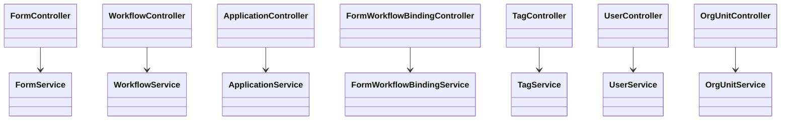
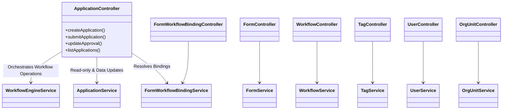
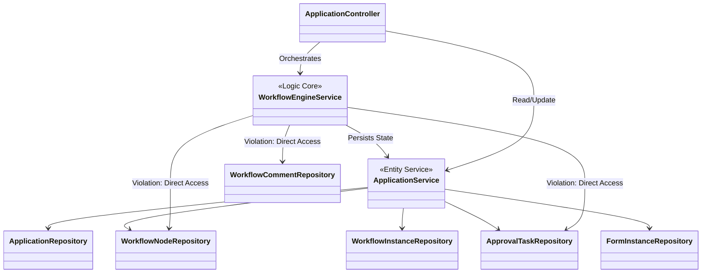
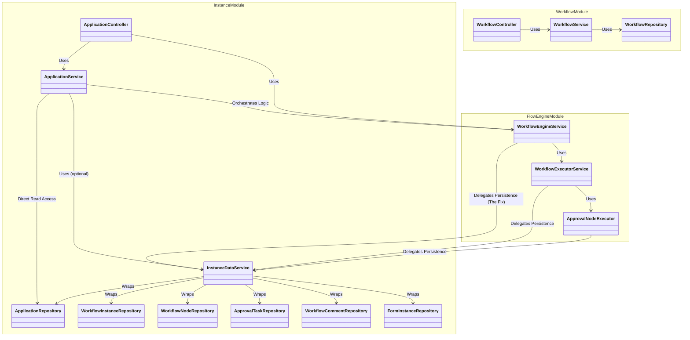

# Refactor Plan: Refactor the architecture between the services and repository

This document outlines the plan and strategy for refactoring the project architecture.

## Objective
There 2 tasks for this refactory plan:
1.  **Merge `database/` into `prisma/`**: Combine these two folders by moving all contents from `src/database/` to `src/prisma/`, then removing `src/database/`.
2.  **Restrict Repository Access**: Decouple repository access so that repositories are only accessed by their corresponding services.

## Detailed Steps

### Part 1: Merge `database` into `prisma`

1.  **Move Files**:
    *   Move `src/database/transaction.service.ts` to `src/prisma/transaction.service.ts`.
    *   Move `src/database/transaction-client.type.ts` to `src/prisma/transaction-client.type.ts`.
2.  **Update `PrismaModule`**:
    *   Add `TransactionService` to the `providers` and `exports` of `PrismaModule` (`src/prisma/prisma.module.ts`).
    *   Remove `DatabaseModule` (`src/database/database.module.ts`) as it becomes redundant.
3.  **Update `AppModule`**:
    *   Remove `DatabaseModule` from imports in `src/app.module.ts`.
    *   Ensure `PrismaModule` is imported (if not already global or imported).
4.  **Update Imports**:
    *   Global search and replace to update import paths from `../database/*` to `../prisma/*`.

### Part 2: Restrict Repository Access

We will enforce the rule: **Service A can only inject Repository A.** If it needs data from Module B, it must inject Service B.

#### 1. FormWorkflowBindingService Refactoring
*   **Goal**: Expose methods required by other services to avoid direct repository access.
*   **Actions**:
    *   Ensure `getBinding(id)` is available.
    *   Add `getBindingFormByWorkflowId(workflowId: number)` method.
    *   Add `findFormIdByWorkflowPublicId(workflowPublicId: string)` method.

#### 2. FormService Refactoring
*   **Goal**: Expose methods for `WorkflowService`.
*   **Actions**:
    *   Add `findActiveFormSchema(formId: number)` method.

#### 3. WorkflowService Refactoring
*   **Goal**: Remove direct dependencies on `FormRepository` and `FormWorkflowBindingRepository`.
*   **Actions**:
    *   Remove `private formRepository: FormRepository`.
    *   Remove `private bindingRepository: FormWorkflowBindingRepository`.
    *   Inject `FormService`.
    *   Inject `FormWorkflowBindingService`.
    *   Replace repository calls with service calls:
        *   `this.bindingRepository.getBindingFormByWorkflowId(...)` -> `this.bindingService.getBindingFormByWorkflowId(...)`
        *   `this.bindingRepository.findFormIdByWorkflowPublicId(...)` -> `this.bindingService.findFormIdByWorkflowPublicId(...)`
        *   `this.formRepository.findActiveFormSchema(...)` -> `this.formService.findActiveFormSchema(...)`

#### 4. ApplicationService Refactoring
*   **Goal**: Remove direct dependency on `FormWorkflowBindingRepository`.
*   **Actions**:
    *   Remove `private bindingRepository: FormWorkflowBindingRepository`.
    *   Inject `FormWorkflowBindingService`.
    *   Replace `this.bindingRepository.getBinding(...)` with `this.bindingService.getBinding(...)`.

#### 5. WorkflowEngineService (Note)
*   **Observation**: `WorkflowEngineService` (in `flow-engine`) accesses repositories in `src/instance`. While technically cross-module, `flow-engine` acts as the logic core for `instance`.
*   **Decision**: Defer strictly wrapping these in an `InstanceService` for now to avoid over-engineering, but acknowledge it as a future task. Focus on the clear violations first.

### Part 3: Refine Flow Engine Architecture (Next Stage)

Goal: Decouple `flow-engine` logic from direct repository access by restructuring the `instance` module's architecture. We will reuse and refactor the existing `ApplicationService` to serve as the data access layer, eliminating circular dependencies.

#### 1. Refactor `ApplicationService` (Data Layer)
Transform `ApplicationService` into a pure **Entity/Data Service**.
*   **Remove Dependency**: Remove `WorkflowEngineService` injection.
*   **Remove Delegation**: Remove methods that purely delegate to the Engine (e.g., `createApplication`, `submit`, `withdraw`, `updateApproval`).
*   **Add Data Methods**: Expose granular methods required by the Engine to persist state (e.g., `createInstanceData`, `updateInstanceStatus`, `saveFormData`).
*   **Scope**: It should wrap `ApplicationRepository`, `WorkflowInstanceRepository`, and `FormInstanceRepository`.

#### 2. Update `ApplicationController` (Orchestration)
Shift the orchestration responsibility from `ApplicationService` to the Controller.
*   **Inject Engine**: Inject `WorkflowEngineService` directly into `ApplicationController`.
*   **Direct Calls**: Update endpoints (`POST /applications`, `PUT /approval`, etc.) to call `WorkflowEngineService` methods directly.
*   **Read Operations**: Continue using `ApplicationService` for read-only operations (listing, getting details).

#### 3. Refactor `WorkflowEngineService` (Logic Layer)
Update the Engine to use the Service layer for data access.
*   **Inject Service**: Inject `ApplicationService`.
*   **Replace Repos**: Replace direct usage of `WorkflowInstanceRepository`, `ApplicationRepository`, and `FormInstanceRepository` with calls to `ApplicationService`.
*   **Note**: For `WorkflowNode` and `ApprovalTask` persistence, we may need to expose methods in `ApplicationService` or create a small `TaskService` if `ApplicationService` becomes too bloated.

#### 4. Execution & Validation
*   Ensure Transaction Context (`tx`) is correctly passed from Controller -> Engine -> Service -> Repository.
*   Verify that `ApplicationService` no longer imports `WorkflowEngineService`.

## Status Log

### 2025-12-31
*   [x] Plan Created.
*   [x] Part 1: Merge `database` into `prisma`.
*   [x] Part 2.1: Refactor `FormWorkflowBindingService`.
*   [x] Part 2.2: Refactor `FormService`.
*   [x] Part 2.3: Refactor `WorkflowService`.
*   [x] Part 2.4: Refactor `ApplicationService`.
*   [x] Part 3: Refine Flow Engine Architecture.

### 2026-01-02
*   [x] Phase 2: Implement Data Provider Pattern.
*   [x] Refactor `WorkflowExecutorService` to use `InstanceDataService`.
*   [x] Refactor `ApprovalNodeExecutor` to use `InstanceDataService`.
*   [x] Verify and remove direct repository injections from `flow-engine` module.

## System Architecture & Dependency Graph

The following graph visualizes the relationships between Services and Repositories, highlighting the current dependencies and identifying targets for the architectural refactoring.

```mermaid
classDiagram
    %% Core Infrastructure
    class PrismaService {
        +PrismaClient
    }
    class TransactionService {
        +runTransaction()
    }
    class SqsService
    class ConfigService

    %% Repositories (Pure Data Access)
    class FormRepository
    class WorkflowRepository
    class WorkflowOptionsRepository
    class FormWorkflowBindingRepository
    class TagRepository
    class UserRepository
    class OrgUnitRepository

    %% Instance Repositories (Workflow Domain)
    class ApplicationRepository
    class WorkflowInstanceRepository
    class WorkflowNodeRepository
    class ApprovalTaskRepository
    class FormInstanceRepository
    class WorkflowCommentRepository

    %% Standard Services
    class FormService
    class WorkflowService
    class FormWorkflowBindingService
    class TagService
    class UserService
    class OrgUnitService
    class NotificationService

    %% Workflow Engine (Domain Core)
    class WorkflowEngineService
    class WorkflowExecutorService
    class ApplicationService
    class FlowAnalysisService
    class FlowValidatorService
    class FormDataValidatorService
    class FormReferenceValidatorService
    class RoutingBuilder

    %% Dependencies - Core
    TransactionService ..> PrismaService
    SqsService ..> ConfigService

    %% Dependencies - Repositories
    FormRepository ..> PrismaService
    WorkflowRepository ..> PrismaService
    WorkflowOptionsRepository ..> PrismaService
    FormWorkflowBindingRepository ..> PrismaService
    TagRepository ..> PrismaService
    UserRepository ..> PrismaService
    OrgUnitRepository ..> PrismaService
    ApplicationRepository ..> PrismaService
    WorkflowInstanceRepository ..> PrismaService
    WorkflowNodeRepository ..> PrismaService
    ApprovalTaskRepository ..> PrismaService
    FormInstanceRepository ..> PrismaService
    WorkflowCommentRepository ..> PrismaService

    %% Dependencies - Standard Services
    FormService ..> FormRepository
    FormService ..> TransactionService

    TagService ..> TagRepository

    FormWorkflowBindingService ..> FormWorkflowBindingRepository

    UserService ..> UserRepository

    OrgUnitService ..> OrgUnitRepository
    OrgUnitService ..> UserService

    NotificationService ..> SqsService

    %% Dependencies - Workflow Domain (Architectural Violations Marked)
    WorkflowService ..> WorkflowRepository
    WorkflowService --|> FormWorkflowBindingRepository : Violation#colon; Cross-Domain Repo
    WorkflowService --|> FormRepository : Violation#colon; Cross-Domain Repo
    WorkflowService ..> FlowValidatorService
    WorkflowService ..> FormReferenceValidatorService
    WorkflowService ..> FlowAnalysisService
    WorkflowService ..> TransactionService

    ApplicationService ..> WorkflowEngineService
    ApplicationService ..> ApplicationRepository
    ApplicationService ..> ApprovalTaskRepository
    ApplicationService --|> FormWorkflowBindingRepository : Violation#colon; Cross-Domain Repo
    ApplicationService ..> RoutingBuilder
    ApplicationService ..> FormDataValidatorService
    ApplicationService ..> FlowAnalysisService
    ApplicationService ..> TransactionService

    WorkflowEngineService ..> TransactionService
    WorkflowEngineService ..> WorkflowExecutorService
    WorkflowEngineService ..> RoutingBuilder
    WorkflowEngineService ..> NotificationService
    WorkflowEngineService ..> WorkflowInstanceRepository
    WorkflowEngineService ..> ApprovalTaskRepository
    WorkflowEngineService ..> WorkflowNodeRepository
    WorkflowEngineService ..> FormInstanceRepository
    WorkflowEngineService ..> WorkflowCommentRepository
    WorkflowEngineService ..> ApplicationRepository
    WorkflowEngineService ..> UserService

    WorkflowExecutorService ..> WorkflowNodeRepository
    WorkflowExecutorService ..> WorkflowInstanceRepository
    WorkflowExecutorService ..> FormInstanceRepository
    WorkflowExecutorService ..> ApprovalTaskRepository
```

## Post-Refactoring Architecture

The following graphs illustrate the system architecture after the refactoring of repository access. The cross-domain repository violations in `WorkflowService` and `ApplicationService` have been resolved by injecting the appropriate services.

### 1. Controllers-Services Dependency Graph
This graph shows the relationship between Controllers and Services.

### 2. Services Internal & Repositories Dependency Graph
This graph shows internal communication between services and their dependencies on repositories and Prisma.

```mermaid
classDiagram
    %% Core Infrastructure
    class PrismaService
    class TransactionService
    class SqsService

    %% Repositories
    class FormRepository
    class WorkflowRepository
    class FormWorkflowBindingRepository
    class TagRepository
    class UserRepository
    class OrgUnitRepository
    class ApplicationRepository
    class WorkflowInstanceRepository
    class WorkflowNodeRepository
    class ApprovalTaskRepository
    class FormInstanceRepository
    class WorkflowCommentRepository

    %% Services
    class FormService
    class WorkflowService
    class FormWorkflowBindingService
    class TagService
    class UserService
    class OrgUnitService
    class NotificationService
    class WorkflowEngineService
    class ApplicationService

    %% Service -> Repository
    FormService ..> FormRepository
    WorkflowService ..> WorkflowRepository
    FormWorkflowBindingService ..> FormWorkflowBindingRepository
    TagService ..> TagRepository
    UserService ..> UserRepository
    OrgUnitService ..> OrgUnitRepository
    ApplicationService ..> ApplicationRepository
    ApplicationService ..> ApprovalTaskRepository

    %% Service -> Service (Inter-service)
    WorkflowService --> FormService
    WorkflowService --> FormWorkflowBindingService
    ApplicationService --> FormWorkflowBindingService
    ApplicationService --> WorkflowEngineService
    WorkflowEngineService ..> NotificationService

    %% Workflow Engine specific
    WorkflowEngineService ..> WorkflowInstanceRepository
    WorkflowEngineService ..> WorkflowNodeRepository
    WorkflowEngineService ..> ApprovalTaskRepository
    WorkflowEngineService ..> FormInstanceRepository
    WorkflowEngineService ..> WorkflowCommentRepository
    WorkflowEngineService ..> ApplicationRepository
    WorkflowEngineService ..> UserService

    %% Infrastructure
    NotificationService ..> SqsService
    TransactionService ..> PrismaService
    FormService ..> TransactionService
    WorkflowService ..> TransactionService
    ApplicationService ..> TransactionService

    %% Repo -> Prisma
    FormRepository ..> PrismaService
    WorkflowRepository ..> PrismaService
    FormWorkflowBindingRepository ..> PrismaService
    TagRepository ..> PrismaService
    UserRepository ..> PrismaService
    OrgUnitRepository ..> PrismaService
    ApplicationRepository ..> PrismaService
    WorkflowInstanceRepository ..> PrismaService
    WorkflowNodeRepository ..> PrismaService
    ApprovalTaskRepository ..> PrismaService
    FormInstanceRepository ..> PrismaService
    WorkflowCommentRepository ..> PrismaService
```

### Architectural Analysis

1.  **Repository Access Violations (Refactor Targets)**:
    *   **WorkflowService**: Currently directly accesses `FormWorkflowBindingRepository` and `FormRepository`. It should instead access `FormWorkflowBindingService` and `FormService`.
    *   **ApplicationService**: Currently directly accesses `FormWorkflowBindingRepository`. It should instead access `FormWorkflowBindingService`.

2.  **The Workflow Domain Core**:
    *   `WorkflowEngineService` and `WorkflowExecutorService` heavily access the "Instance" repositories (`WorkflowInstanceRepository`, `WorkflowNodeRepository`, etc.). This is acceptable as they form the domain layer for workflow execution.

3.  **Transaction Orchestration**:
    *   `TransactionService` is correctly used by high-level services to manage atomicity.

4.  **Circular Dependency Check**:
    *   The graph shows a generally clean flow. `WorkflowService` depending on `FormService` is safe as `FormService` is standalone. `WorkflowEngineService` uses `UserService` which is also standalone. No immediate circular risks detected.

## Post-Part 3 Analysis: Flow Engine Refactoring

Following the execution of Part 3, the architecture has shifted significantly to decouple the Logic Layer (`WorkflowEngineService`) from the Data Layer (`ApplicationService`).

### Updated Dependency Graph

#### 1. Controllers-Services Dependency Graph
This graph illustrates the entry points and orchestration flow. Notice how `ApplicationController` now acts as the primary orchestrator between the Engine and the Data Service.

#### 2. Services Internal & Repositories Dependency Graph
This graph shows the underlying data flow. `ApplicationService` now serves as the centralized data gateway for "Instance" related entities, shielding the Engine from direct repository access for those types.

```mermaid
classDiagram
    %% Core Infrastructure
    class PrismaService
    class TransactionService
    class SqsService

    %% Repositories (Persistence)
    class ApplicationRepository
    class WorkflowInstanceRepository
    class FormInstanceRepository
    class WorkflowNodeRepository
    class ApprovalTaskRepository
    class FormRepository
    class WorkflowRepository
    class TagRepository
    class UserRepository
    class OrgUnitRepository

    %% Standard Services
    class FormService
    class WorkflowService
    class FormWorkflowBindingService
    class TagService
    class UserService
    class OrgUnitService
    class NotificationService

    %% Logic Layer
    class WorkflowEngineService
    class WorkflowExecutorService

    %% Data Layer (Aggregates)
    class ApplicationService {
        <<Entity Service>>
    }

    %% Relationships - Logic to Data/Repos
    WorkflowEngineService --> ApplicationService : Persists Instance State
    WorkflowEngineService --> WorkflowExecutorService
    WorkflowEngineService --> ApprovalTaskRepository : Direct Access (Tasks)
    WorkflowEngineService --> WorkflowNodeRepository : Direct Access (Nodes)
    WorkflowEngineService --> NotificationService

    %% Notification Chain
    NotificationService --> SqsService

    %% Relationships - Standard Service to Repos
    FormService ..> FormRepository
    WorkflowService ..> WorkflowRepository
    FormWorkflowBindingService ..> FormWorkflowBindingRepository
    TagService ..> TagRepository
    UserService ..> UserRepository
    OrgUnitService ..> OrgUnitRepository

    %% Relationships - Entity Service to Repos
    ApplicationService --> ApplicationRepository
    ApplicationService --> WorkflowInstanceRepository
    ApplicationService --> FormInstanceRepository
    ApplicationService --> WorkflowNodeRepository
    ApplicationService --> ApprovalTaskRepository

    %% Cross-Domain Injection (Refactored)
    WorkflowService --> FormService
    WorkflowService --> FormWorkflowBindingService

    %% Infrastructure
    ApplicationService ..> TransactionService
    WorkflowEngineService ..> TransactionService
    TransactionService ..> PrismaService

    %% Repos to Prisma
    ApplicationRepository ..> PrismaService
    WorkflowInstanceRepository ..> PrismaService
    FormInstanceRepository ..> PrismaService
    WorkflowNodeRepository ..> PrismaService
    ApprovalTaskRepository ..> PrismaService
    FormRepository ..> PrismaService
    WorkflowRepository ..> PrismaService
    TagRepository ..> PrismaService
    UserRepository ..> PrismaService
    OrgUnitRepository ..> PrismaService
    FormWorkflowBindingRepository ..> PrismaService
```

### Key Improvements
1.  **Broken Circular Service Dependency**: `ApplicationService` no longer depends on `WorkflowEngineService`. The cycle `AppService <-> Engine` is broken.
2.  **Clearer Responsibilities**:
    *   **Controller**: Orchestrates high-level operations (Validate -> Create -> Submit).
    *   **WorkflowEngine**: Handles the complexity of the state machine and node execution.
    *   **ApplicationService**: Acts as a centralized data access layer for Application/Instance entities, shielding the Engine from some low-level repository details.

### Remaining Considerations
1.  **Module-Level Circularity**:
    *   `InstanceModule` (Controller/AppService) imports `FlowEngineModule` (Engine/Validator/RoutingBuilder).
    *   `FlowEngineModule` (Engine) imports `InstanceModule` (AppService).
    *   This requires `forwardRef` in NestJS modules. While Service-level circularity is gone, Module-level circularity remains due to the functional coupling between Data and Logic layers residing in different modules.
2.  **Hybrid Repository Access**: `WorkflowEngineService` still accesses `WorkflowNodeRepository` and `ApprovalTaskRepository` directly. This was a pragmatic choice to avoid bloating `ApplicationService`, but these could be moved to a `TaskService` (in `instance` module) in a future refactoring step to fully isolate the Engine from Repositories.

# Phase 2: The Data Provider Pattern (Refining Flow Engine Architecture)

Following the completion of Part 3 (Refining Flow Engine Architecture), we identified that while the circular dependency between `ApplicationService` and `WorkflowEngineService` was broken, `WorkflowEngineService` still retains direct access to Repositories (`WorkflowNodeRepository`, `ApprovalTaskRepository`). This violates the strict layering where the Engine (Logic) should not know about Persistence details.

To address this and further improve cohesion, we will implement the **Data Provider Pattern**.

## Objective
Establish a clean separation of concerns where `WorkflowEngineService` relies on a dedicated **Data Service** for all persistence needs, rather than accessing Repositories directly. This Service will reside in the `instance` module and act as the "Persistence Layer" for the Engine.

## Architectural Changes

### 1. New Service: `InstanceDataService`
*   **Location**: `src/instance/instance-data.service.ts`
*   **Responsibility**: Pure data access and atomic operations for Workflow instances, Nodes, and Tasks.
*   **Dependencies**: Injects Repositories (`ApplicationRepository`, `WorkflowInstanceRepository`, `WorkflowNodeRepository`, `ApprovalTaskRepository`, `WorkflowCommentRepository`).
*   **Constraints**: Must **NOT** inject `WorkflowEngineService` (to prevent circular dependency).

### 2. Refactored `WorkflowEngineService`
*   **Dependencies**: Removes all Repository injections. Injects `InstanceDataService`.
*   **Responsibility**: Pure state machine logic, validation, and orchestration of execution flow. Delegates all DB writes/reads to `InstanceDataService`.

### 3. `ApplicationService` (Orchestrator)
*   **Role**: Remains the entry point for business actions (e.g., `submit`, `approve`).
*   **Dependencies**: Injects `WorkflowEngineService` to trigger logic.

## Detailed Execution Plan

### Step 1: Create `InstanceDataService`
Create `src/instance/instance-data.service.ts`.
Move raw DB operation methods from `WorkflowEngineService` into this service.
*   *Ex:* `createWorkflowNode`, `updateApprovalTaskStatus`, `getWorkflowState`.

### Step 2: Refactor `WorkflowEngineService`
Update `src/flow-engine/workflow-engine.service.ts`.
*   Replace `private readonly repo: Repo` with `private readonly dataService: InstanceDataService`.
*   Update logic to call `dataService` methods.

### Step 3: Verify & Cleanup
*   Ensure `WorkflowEngineService` imports no Repositories.
*   Run tests to ensure no regression in flow execution.

## Current Dependency State (Pre-Phase 2)

Currently, the `WorkflowEngineService` exists in a "hybrid" state. While Part 3 decoupled it from `ApplicationRepository`, it still maintains direct dependencies on low-level task/node repositories. This creates a violation of the Logic Layer's boundaries and complicates the `Instance` module's architecture.

### Current Dependency Graph (Architectural Violation)

## Target Dependency Flow
`Controller` -> `ApplicationService` (Orchestrator) -> `WorkflowEngineService` (Logic) -> `InstanceDataService` (Persistence) -> `Repositories`

**Benefits:**
*   **Strict Layering:** Logic is decoupled from Persistence.
*   **No Circular Dependencies:** The dependency chain is linear (downwards).
*   **Testability:** Engine logic can be tested by mocking the DataService.

## Post-Phase 2 Refactoring Dependency Graph

The following graph illustrates the architectural state of the `instance` and `workflow` modules after the Phase 2 refactoring, highlighting the role of `InstanceDataService` as the Data Provider for the Workflow Engine.

