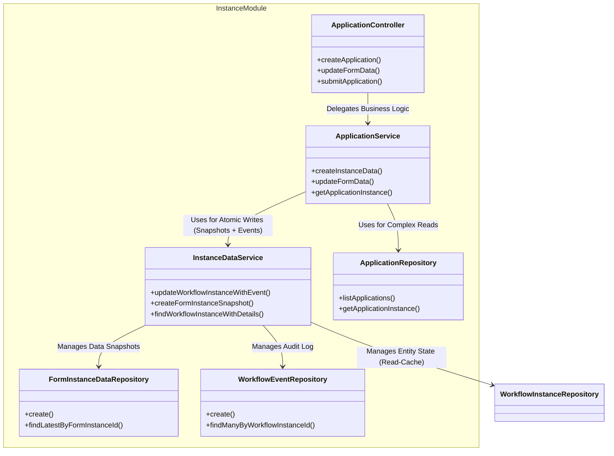

# Refactor Plan: Instance History & Event Sourcing

This document outlines the strategy for refactoring the `instance` module to separate **mutable state** (data, status) from **identity entities** (instances), effectively implementing an Event Sourcing-lite pattern.

## Objective
To make the system more robust for auditing, history tracking, and "time-travel" debugging by distinguishing between "Who am I?" (Identity) and "What is my state?" (History/Snapshot).

## Architectural Concept: Separation of Identity & State

### 1. Form Instance Refactoring
Currently, `FormInstance` mixes identity (`id`, `serial_number`) with mutable data (`form_data`, `updated_at`).

**Strategy:**
*   **`FormInstance` (Identity)**: Only keeps immutable references.
*   **`FormSnapshot` (State)**: Records every version of the data (Autosaves, Submissions).

### 2. Workflow Instance Refactoring
Currently, `WorkflowInstance` holds the *current* status and timestamps of various lifecycle events (`applied_at`, `completed_at`, `withdraw_at`), which makes the table cluttered and hard to query for complex history.

**Strategy:**
*   **`WorkflowInstance` (Identity & Read-Cache)**: Keeps identity and a cached `status` for performance.
*   **`WorkflowEvent` (State Log)**: Records every lifecycle event (SUBMIT, APPROVE, WITHDRAW, etc.) with `status_before` and `status_after`.

## Performance & Data Synchronization

**The "Read-Cache" Pattern**

We will **keep** the `status` column (and `updated_at`) in the main Entity table (`WorkflowInstance`), even though the "truth" is stored in the History/Event table.

*   **Why? (Performance)**: Most application queries are filters like *“Show me all RUNNING applications”*. Without the column, every list query becomes a complex aggregation.
*   **How to Sync? (Consistency)**: Using `TransactionService`, every state change must execute two operations atomically:
    1.  **Insert** into the History/Event table (The Audit Log).
    2.  **Update** the Entity table (The Current State Cache).

## Proposed Schema (Prisma)

### 1. Naming Rules
*   **Entity (Identity)**: Nouns, Plural (e.g., `form_instances`, `workflow_instances`).
*   **Data Versioning**: `<Entity>Snapshot` (e.g., `form_snapshots`).
*   **State Transitions**: `<Entity>Event` (e.g., `workflow_events`).

### 2. Schema Definition

```prisma
// 1. Identity Table
model FormInstance {
  id                   Int               @id @default(autoincrement())
  public_id            String            @unique @default(uuid()) @db.Uuid
  workflow_instance_id Int               @unique
  serial_number        String
  revision_id          Int

  // Relations
  workflow_instance    WorkflowInstance  @relation(fields: [workflow_instance_id], references: [id], onDelete: Cascade)
  form_revision        FormRevision      @relation(fields: [revision_id], references: [id], onDelete: Cascade)
  application_instance ApplicationInstance? @relation(fields: [serial_number], references: [serial_number], onDelete: Cascade)

  data_history         FormInstanceData[]

  @@map("form_instances")
}

// 2. Data Table
model FormInstanceData {
  id               Int          @id @default(autoincrement())
  form_instance_id Int
  data             Json         // The actual form data content

  created_at       DateTime     @default(now()) // Version timestamp
  created_by       Int          // The editor

  form_instance    FormInstance @relation(fields: [form_instance_id], references: [id], onDelete: Cascade)
  creator          User         @relation(fields: [created_by], references: [id])

  @@map("form_instance_data")
}

// 3. Identity Table
model WorkflowInstance {
  id                Int            @id @default(autoincrement())
  public_id         String         @unique @default(uuid()) @db.Uuid
  serial_number     String
  revision_id       Int
  applicant_id      Int
  priority          PriorityLevel  @default(NORMAL)
  current_iteration Int            @default(1)

  // KEEPING THIS for Performance (Read-Cache)
  status            InstanceStatus @default(DRAFT)

  created_at        DateTime       @default(now())
  updated_at        DateTime       @updatedAt

  // Removed: submitter_id, withdraw_by, applied_at, completed_at...

  // Relations
  revision          WorkflowRevisions @relation(fields: [revision_id], references: [id], onDelete: Cascade)
  applicant         User              @relation("Applicant", fields: [applicant_id], references: [id])
  application_instance ApplicationInstance @relation(fields: [serial_number], references: [serial_number], onDelete: Cascade)
  form_instances    FormInstance[]

  events            WorkflowEvent[]

  @@map("workflow_instances")
}

// 4. Event/History Table
model WorkflowEvent {
  id                   Int            @id @default(autoincrement())
  workflow_instance_id Int

  event_type           WorkflowAction
  status_before        InstanceStatus?
  status_after         InstanceStatus

  actor_id             Int
  created_at           DateTime       @default(now())
  details              Json?          // Extra info (e.g. comment snapshot, reason)

  workflow_instance    WorkflowInstance @relation(fields: [workflow_instance_id], references: [id], onDelete: Cascade)
  actor                User             @relation(fields: [actor_id], references: [id])

  @@map("workflow_events")
}
```

## Migration Plan (The "Expand and Contract" Pattern)

### Phase 1: Expand (Schema Change)
*   Create `FormSnapshot` table.
*   Create `WorkflowEvent` table.
*   **Important**: Do not delete old columns yet to ensure backward compatibility during migration.

### Phase 2: Migrate Data (Prisma Migrate Custom SQL)
*   **Strategy**: Instead of an external script, we will embed the data migration logic directly into the Prisma Migration SQL file. This ensures atomic schema and data changes, suitable for CI/CD.
*   **Steps**:
    1.  Run `prisma migrate dev --create-only` to generate the SQL file.
    2.  Append custom SQL logic to "unpivot" the history columns into the new Event table:
        *   **Form Data**: `INSERT INTO form_snapshots ... SELECT form_data ...`
        *   **Draft Event**: `INSERT INTO workflow_events ... SELECT created_at ...`
        *   **Submit Event**: `INSERT INTO workflow_events ... SELECT applied_at ...`
        *   **Withdraw Event**: `INSERT INTO workflow_events ... SELECT withdraw_at ...`
    3.  Apply the migration.

### Phase 3: Code Refactor
*   **InstanceDataService**: Update to write to new tables inside transactions.
*   **ApplicationRepository**: Update to read from new tables (fetching latest snapshot for data).
*   **ApplicationController**: Expose history API from new tables.

### Phase 4: Contract (Cleanup)
*   Remove `form_data` from `FormInstance`.
*   Remove `applied_at`, `completed_at`, `withdraw_at`, `withdraw_by`, `submitter_id` from `WorkflowInstance`.

## Target Tables Summary

| Entity | Mutable Data (Move to new table) | Identity Metadata (Keep) | New Table Purpose |
| :--- | :--- | :--- | :--- |
| **FormInstance** | `form_data` | `id`, `serial_number`, `revision_id` | **Versioning** |
| **WorkflowInstance** | `applied_at`, `completed_at`, `withdraw_at`, `withdraw_by`, `submitter_id` | `id`, `serial_number`, `applicant_id`, `priority`, **`status` (Cached)** | **Audit Trail** |

## Implementation Analysis & Review (Post-Refactoring)

Following the execution of the refactoring plan, the codebase has successfully transitioned to the new architecture. Below is an analysis of the implemented structure.

### 1. Instance Module Architecture (Updated)

The `InstanceModule` has been reinforced with a clear separation between **Data Orchestration** (`ApplicationService`), **Persistence Logic** (`InstanceDataService`), and **Low-level Data Access** (Repositories).



### 2. Key Improvements & Patterns

*   **Atomic State Transitions**: The `InstanceDataService.updateWorkflowInstanceWithEvent` method ensures that every status change (e.g., `RUNNING` -> `COMPLETED`) is atomically coupled with an insert into `WorkflowEvent`. This guarantees the audit log never drifts from the current state.
*   **Immutable Form History**: `FormInstanceData` (implemented as `form_instance_data` table) now captures every save operation. The `ApplicationRepository` has been updated to fetch the *latest* snapshot (`orderBy: { created_at: 'desc' }, take: 1`) when reconstructing the current application state, effectively treating the latest snapshot as the "current" data.
*   **Simplified Schema**: The removal of `form_data` from `FormInstance` and multiple timestamp columns from `WorkflowInstance` has significantly cleaned up the core tables, leaving them as lightweight identity records.

### 3. Implementation Verification

*   **Migration**: The custom SQL migration safely moved existing data to the new tables.
*   **E2E Tests**: The `test_application_management.py` suite passed, verifying that the external API behavior remains consistent despite the major internal architectural shift.
*   **Unit Tests**: Controller and service tests confirmed no regressions in logic.

This refactoring successfully establishes a robust foundation for future features like "Time Travel" (viewing an application exactly as it looked in the past) and detailed Audit Logs.