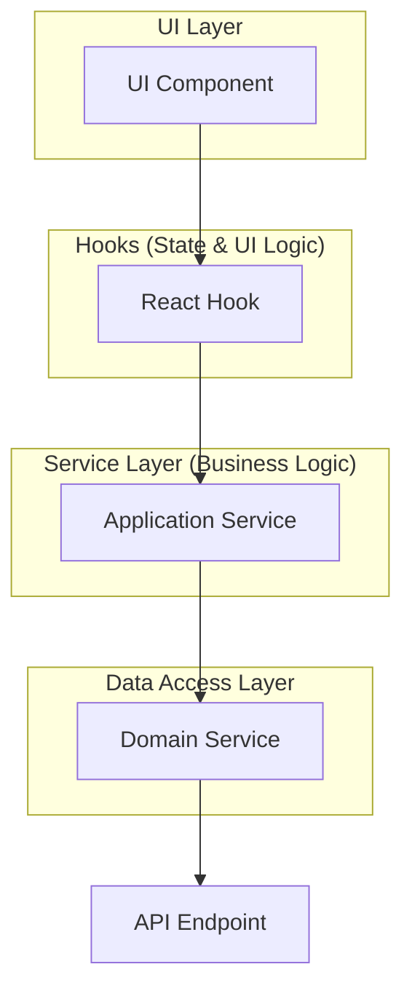

# Architectural Abstraction Guide

This document outlines the layered architectural pattern used in this project. Following this guide ensures separation of concerns, testability, and maintainability.

## 1. The Layers of Abstraction

Our application architecture is divided into several distinct layers. Data and function calls flow from the UI down to the data source, with each layer having a specific responsibility.



-   **UI Components (`/pages` or `/components`):** The view layer. Components should be as "dumb" as possible. Their primary role is to display data and call hooks to handle user interactions and data fetching.

-   **React Hooks (`/hooks`):** The presentation logic layer. This is where UI-related state is managed. For server state (fetching/updating data), hooks should use **React Query** (`useQuery`, `useMutation`). The functions inside these hooks call methods on the Application Services.

-   **Application Services (`/services`):** The core business logic layer. Each service handles a specific feature or domain (e.g., `ApplicationService`, `FormService`). These services implement the business rules and delegate the actual data fetching/sending to the `DomainService`.

-   **Domain Service (`/services/domain-service.ts`):** The single point of contact with the backend API. This service is responsible for making all HTTP requests (e.g., using `axios`). It is injected into the Application Services and adapts API payloads to the shapes expected throughout the app.

-   **Interfaces (`/interfaces`):** The contracts that decouple the layers. By defining interfaces for our services (`IApplicationService`, `IDomainService`), we can use Dependency Injection (Inversify) to easily swap implementations, which is crucial for mocking and testing.

## 2. Process for Adding a New Feature

When adding a new feature that requires fetching or sending data (e.g., "Get a list of all purchase orders"), follow these steps from the bottom up.

### Step 1: Define the Contract (The Interface)

Start in `src/interfaces/services.ts`. This is the source of truth for your function's signature.

1.  Add the new function signature to the domain-specific interface (e.g., `IPurchaseOrderService`).
2.  Add the same function signature to the generic `IDomainService` interface.

**Example:**
```typescript
// In IApplicationService
export interface IApplicationService {
  // ... existing methods
  getApplications(options?: any): Promise<PaginatedApiResponse<Application>>;
}

// In IDomainService
export interface IDomainService {
  // ... existing methods
  getApplications(options?: any): Promise<PaginatedApiResponse<Application>>;
}
```

### Step 2: Implement the Data Access Layer

Now, implement the function you just defined.

1.  **Mock Implementation:** In `src/services/mock/domain-service.ts`, add the mock version of your function. This should return realistic-looking mock data and is essential for UI development and testing.
2.  **Real Implementation:** In the real `DomainService` (if it exists), implement the function to make the actual HTTP API call.

### Step 3: Implement the Application Service

In the corresponding application service file (e.g., `src/services/application-service.ts`):

1.  Add the new method from the interface.
2.  The implementation should simply delegate the call to the `domainService` that was injected in the constructor.

**Example:**
```typescript
// In ApplicationService
async getApplications(options?: any): Promise<PaginatedApiResponse<Application>> {
  return this.domainService.getApplications(options);
}
```

### Step 4: Create the Custom Hook

In the `src/hooks/` directory, create or update a hook for your feature (e.g., `useApplication.ts`).

1.  Create a new exported function (e.g., `useApplications`).
2.  Inside the hook, use `useQuery` for fetching data or `useMutation` for creating/updating/deleting data.
3.  The `queryFn` or `mutationFn` should call the method on your Application Service.

**Example:**
```typescript
// In useApplication.ts
export const useApplications = (options?: any) => {
  const applicationService = useApplicationService();
  return useQuery({
    queryKey: ["applications", options], // A unique key for this query
    queryFn: () => applicationService.getApplications(options),
  });
};
```

### Step 5: Use the Hook in a UI Component

Finally, in your page or component, call the hook you just created.

**Example:**
```tsx
// In DashboardPage.tsx
const { data, isLoading, isError } = useApplications({ pageSize: 5 });

if (isLoading) return <p>Loading...</p>;

return <MyTable data={data?.items || []} />;
```

### Step 6: Wire Filters & Sorters (example)

Endpoints that expose rich query parameters (such as `/applications/available`) should keep those concerns inside the hook/application-service layers so UI components stay simple.

```tsx
// Hook call from a page
const applicationFormFilters = useMemo(() => ({
  page: 1,
  pageSize: 10,
  filter: {
    formName: searchQuery.trim() || undefined,
    formTagIds: selectedTag ? [Number(selectedTag)] : undefined,
  },
  sorter: { sortOrder: "desc" },
}), [searchQuery, selectedTag]);

const { forms } = useApplicationForms(applicationFormFilters);
```

```ts
// ApplicationService → DomainService
async getApplicationForms(options?: ApplicationFormOptions) {
  const normalizedOptions = normalize(options); // defaults + trims + number casting
  return this.domainService.getApplicationForms(normalizedOptions);
}
```

```ts
// DomainService
const params = {
  page,
  limit,
  formName: filter?.formName,
  formTagIds: filter?.formTagIds, // serialized via qs.stringify({ arrayFormat: "repeat" })
  sortOrder: sorter?.sortOrder ?? "desc",
};
const result = await apiCaller.get(`/applications/available?${qs.stringify(params, { skipNulls: true })}`);
```

This pattern keeps the UI unaware of HTTP details while still giving full control over server-side filtering, pagination, and sorting.

### Passing filters & sorters end-to-end (actual example)

When an API supports filter/sorter/pagination, pass a single `options` object from the UI down through the hook and service layers. Each layer is responsible for one step:

1. **UI** builds the `options` shape (only UI concerns).
2. **Hook** normalizes options for stable caching and calls the service.
3. **ApplicationService** normalizes again (defensive) and delegates to DomainService.
4. **DomainService** converts options into query params and builds the URL.

```tsx
// src/pages/DashboardPage.tsx
const { applications, isLoading } = useApplications({
  type: activeTab,
  filter:
    activeTab === "application"
      ? { overallStatus: OverallStatus.InProgress }
      : { reviewStatus: ReviewStatus.Pending },
  sorter: activeTab === "application" ? undefined : { submittedAt: "desc" },
  pageSize: 3,
});
```

```ts
// src/hooks/useApplication.ts
export const useApplications = (options?: ApplicationOptions) => {
  const applicationService = useApplicationService();
  const normalizedOptions = useMemo(
    () => normalizeApplicationOptions(options),
    [options],
  );
  return useQuery({
    queryKey: applicationsListQueryKey(normalizedOptions),
    queryFn: () => applicationService.getApplications(normalizedOptions),
  });
};
```

```ts
// src/services/application-service.ts
async getApplications(options?: ApplicationOptions) {
  const normalizedOptions = normalizeApplicationOptions(options);
  return this.domainService.getApplications(normalizedOptions);
}
```

```ts
// src/services/domain-service.ts
const params = {
  page,
  limit,
  overallStatus: mapOverallStatus(filter?.overallStatus),
  approvalStatus: mapApprovalStatus(filter?.reviewStatus),
  submittedBy: filter?.submittedBy,
  assigneeId: filter?.assigneeId,
  formName: filter?.q,
  workflowName: filter?.workflowName,
  formTagIds: normalizeIds(filter?.formTagIds),
  workflowTagIds: normalizeIds(filter?.workflowTagIds),
  sortOrder: sorter?.submittedAt,
};
const queryString = qs.stringify(params, { arrayFormat: "repeat", skipNulls: true });
const baseUrl = `/applications?filter=${options?.type === "approval" ? "approving" : "submitted"}`;
const url = queryString ? `${baseUrl}&${queryString}` : baseUrl;
const result = await apiCaller.get(url);
```

This keeps the UI simple while the DomainService owns HTTP details like query string shape and enum mapping.

By following this process, you ensure that each layer has a single responsibility, making the code easier to debug, test, and scale.

---

## Mutating Application Data (Example: Update)

The mutation pattern mirrors the fetch flow. Below is the end-to-end example for updating an application.

### 1. Interface & Domain

Add the contract to both interfaces and implement it in the domain service (mock + real):

```ts
updateApplication(
  id: string,
  application: Partial<Application>,
): Promise<ApiResponse<Application>>;
```

### 2. Application Service

Delegate to the domain service inside `ApplicationService`:

```ts
async updateApplication(
  id: string,
  application: Partial<Application>,
) {
  return this.domainService.updateApplication(id, application);
}
```

### 3. Hook

Create a mutation hook in `useApplication.ts`:

```ts
export const useUpdateApplication = (options?: {
  onSuccess?: (
    data: ApiResponse<Application>,
    variables: { id: string; application: Partial<Application> },
  ) => void;
  onError?: (error: Error) => void;
}) => {
  const queryClient = useQueryClient();
  const applicationService = useApplicationService();

  return useMutation({
    mutationFn: ({ id, application }) =>
      applicationService.updateApplication(id, application),
    onSuccess: (data, variables) => {
      queryClient.invalidateQueries({ queryKey: ["applications"] });
      queryClient.setQueryData(applicationQueryKey(variables.id), data);
      options?.onSuccess?.(data, variables);
    },
    onError: (error) => {
      console.error("Update application failed:", error);
      options?.onError?.(error);
    },
  });
};
```

### 4. UI Usage

```tsx
const updateApplication = useUpdateApplication({
  onSuccess: () => toast.success("Application updated"),
});

updateApplication.mutate({ id: applicationId, application: payload });
```

Following these steps keeps app mutations consistent, testable, and aligned with the overall architecture.
